<picture>
  <source media="(prefers-color-scheme: dark)" srcset="./dark.svg">
  <source media="(prefers-color-scheme: light)" srcset="./light.svg">
  
</picture>

# Hi, I'm Amir Mohammad Asgari | امیرمحمد عسگری

### Data Scientist | Python Developer | Django Backend Developer

I build backend platforms with Python and Django, and I’m focused on Data Science, Machine Learning, and practical AI projects.

- 🌐 Website: [am-asgari.ir](https://www.am-asgari.ir/)
- 💻 GitHub: [github.com/mr-amirasgari](https://github.com/mr-amirasgari)
- 📺 YouTube: [youtube.com/@mr_amirasgari](https://youtube.com/@mr_amirasgari)
- 𝕏 X: [x.com/mr_amirasgari](https://x.com/mr_amirasgari)
- ✈️ Telegram: [t.me/mr_amirasgari](https://t.me/mr_amirasgari)

---

## About Me

- Data Scientist focused on practical AI and machine learning projects
- Python developer with backend development experience
- Building web platforms with Django
- Interested in Machine Learning, automation, and n8n
- Passionate about clean, useful, and scalable software

من امیرمحمد عسگری هستم و این GitHub بخشی از هویت رسمی آنلاین من است.  
سایت شخصی من: [am-asgari.ir](https://www.am-asgari.ir/)

---

## Tech Stack


---

## Featured Projects

- [AI Chatbot Directory](https://github.com/mr-amirasgari/ai-chatbot-directory)
- [Diabetes ML Project](https://github.com/mr-amirasgari/diabet)
- [Medical Ruleset Visualization](https://github.com/mr-amirasgari/medical-ruleset-visualizer)
- [Pathfinding Project](https://github.com/mr-amirasgari/pathfinding-project)

---

## Current Focus

```python
amir = {
    "name": "Amir Mohammad Asgari",
    "role": "Data Scientist",
    "backend": "Python / Django",
    "field": "Data Science and Machine Learning",
    "learning": ["Machine Learning", "Automation", "n8n"],
    "website": "https://www.am-asgari.ir/",
    "github": "https://github.com/mr-amirasgari",
    "goal": "Build useful, scalable, and data-driven software"
}
```

---

## Contact Me

- Website: [https://www.am-asgari.ir/](https://www.am-asgari.ir/)
- GitHub: [https://github.com/mr-amirasgari](https://github.com/mr-amirasgari)
- YouTube: [https://youtube.com/@mr_amirasgari](https://youtube.com/@mr_amirasgari)
- X: [https://x.com/mr_amirasgari](https://x.com/mr_amirasgari)
- Telegram: [https://t.me/mr_amirasgari](https://t.me/mr_amirasgari)

---

### Thanks for visiting my GitHub profile!
